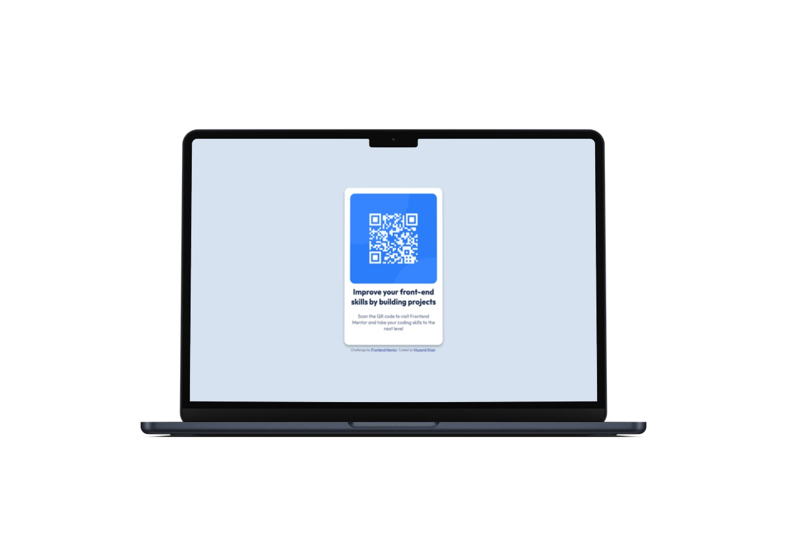
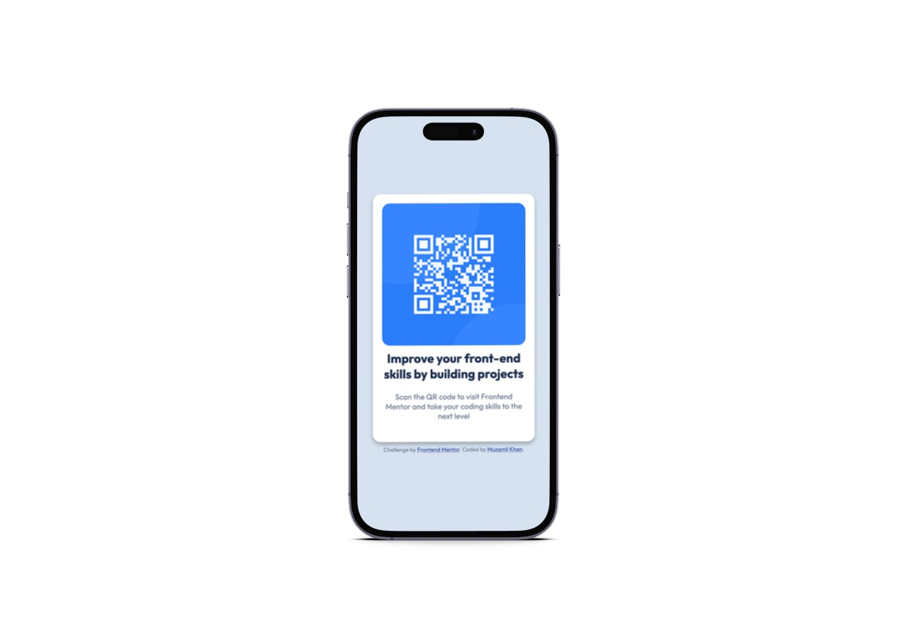

# Frontend Mentor - QR code component solution

This is a solution to the [QR code component challenge on Frontend Mentor](https://www.frontendmentor.io/challenges/qr-code-component-iux_sIO_H). Frontend Mentor challenges help you improve your coding skills by building realistic projects.

## Table of contents

- [Overview](#overview)
  - [Screenshot](#screenshot)
  - [Links](#links)
  - [Built with](#built-with)

## Overview

### Screenshot

|          Desktop view          |          Mobile view           |
| :----------------------------: | :----------------------------: |
|  |  |

### Links

- Live Site URL: [Add live site URL here](https://m-zamil.github.io/qr-code-component)

### Built with

- Semantic HTML5 markup
- CSS custom properties
- Responsive images
- Mobile-first workflow
